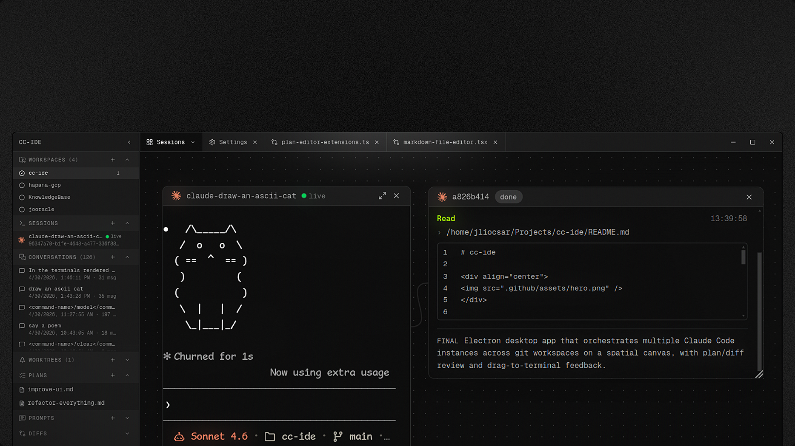

# cc-ide

<div align="center">

</div>

Electron desktop app to orchestrate multiple Claude Code instances across projects, worktrees, and a spatial canvas with PR-review-style plan and diff feedback that drags directly into any running Claude.

## What it does

- **Register git workspaces** and switch between them from the sidebar or command palette.
- **Spawn and resume Claude sessions** backed by tmux. Each workspace gets one tmux session; each Claude instance gets its own window; each canvas window gets an isolated grouped viewer so multiple windows can view different Claudes at once.
- **Spatial canvas** — pan, zoom, drag, and resize xterm.js windows. Per-workspace layout is persisted.
- **Plans** — per-workspace markdown tree under `$HOME/.cc-ide/plans/<workspaceId>/`. Open a plan, click/shift-click lines to build comment ranges, drag the tab into a Claude window and the exact `@.cc-ide/plans/...md` + `@@ start,len @@` block is pasted in.
- **Diffs** — per-worktree staged+unstaged changes in a side-by-side view. Comment on lines on the new side; drag into Claude the same way.
- **Prompts** — cross-project prompt library with search, favorites, and one-key paste into the last-focused terminal (`Ctrl+K` → Open Prompts).
- **Worktrees** — list, create, and safely delete (guardrail: no uncommitted changes + pushed to remote).

## Stack

Electron 33, React 18, TypeScript strict, Vite via `electron-vite`, TanStack Router (pending), TanStack Query (pending), Zustand, Zod, Tailwind v4, shadcn/ui, cmdk, Lucide, xterm.js, node-pty, Vitest. pnpm.

## Requirements

- Node 20+ (Electron runtime requirement).
- `tmux` on `PATH`.
- `git` on `PATH`.
- Claude Code CLI (`claude`) on `PATH` — spawned by the IDE.

## Scripts

```bash
pnpm install          # installs deps + rebuilds node-pty against electron
pnpm dev              # electron-vite dev; opens the IDE with DevTools + CDP on 9223
pnpm build            # typecheck + build main/preload/renderer
pnpm test             # vitest run
pnpm test:watch       # vitest watch
pnpm typecheck        # tsc --noEmit (composite)
pnpm rebuild          # re-bind node-pty to electron's ABI
```

## Data layout

IDE data (writable):

```
$HOME/.cc-ide/
├── workspaces.json                    # registry (UUID ids + display name)
├── prompts.json                       # cross-project prompts
├── canvas/<workspaceId>.json          # camera + windows per workspace
└── plans/<workspaceId>/**/*.md        # plan tree
```

Claude data (read-only):

```
~/.claude/projects/<slug>/*.jsonl      # Claude's own session transcripts
```

See [.claude/references/data-paths.md](.claude/references/data-paths.md) for details.

## Keyboard shortcuts

- `Ctrl+K` / `Cmd+K` — command palette
- `Ctrl+W` / `Cmd+W` — close active tab (Board is pinned)
- `Ctrl+B` / `Cmd+B` — toggle sidebar
- `Ctrl+0` — reset canvas camera
- `Ctrl+=` / `Ctrl+-` — zoom in/out on viewport center

## Contributing / agent work

See [CLAUDE.md](CLAUDE.md) for agent instructions and [HANDOFF.md](HANDOFF.md) to pick up where we left off.

## License

Private / unpublished. No license granted.
